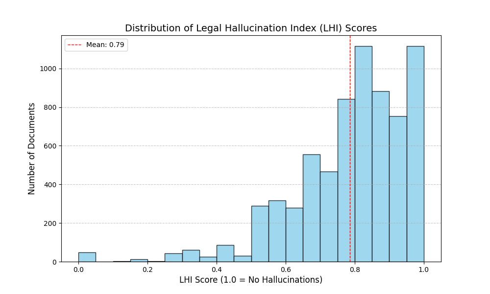
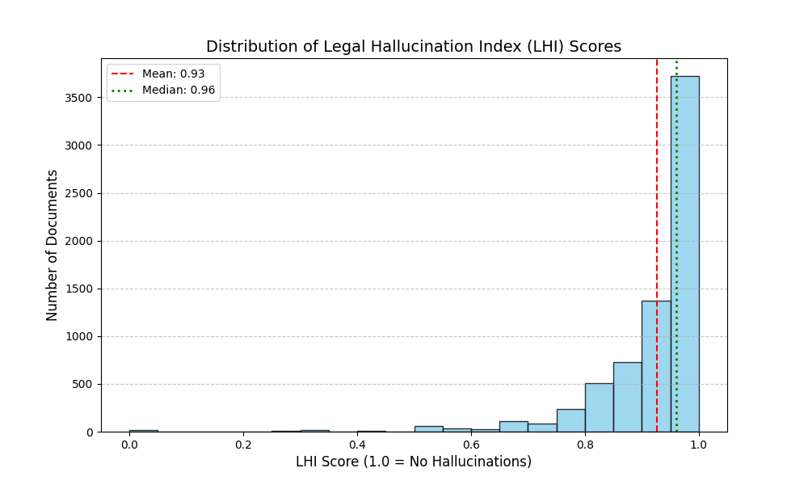

#L_CRS
## Legal Hallucination Index (LHI) 

This repository implements a high-precision pipeline for calculating the **Legal Hallucination Index (LHI)**. The LHI measures the factual faithfulness of AI-generated legal summaries by verifying that every entity (Person, Date, Case Reference) in the summary can be grounded in the original source document.

---

## 📊 Methodology & Progress

The accuracy of our hallucination detection has evolved through three distinct iterations. By moving from character-matching to semantic-understanding, we have significantly reduced false-positive hallucination flags.

### 1. Exact String Matching
* **Logic:** Character-for-character comparison after basic normalization.
* **Problem:** Fails on minor variations like "Mr. Singh" vs "Singh" or "Section 144" vs "Sec. 144".
* **Result:** Underestimates LHI score due to rigid matching.


### 2. Fuzzy Logic + Date Parsing
* **Logic:** Leverages Levenshtein Distance for similarity and `dateparser` for temporal normalization.
* **Advantage:** Recognizes that "05-11-1980" and "Nov 5, 1980" represent the same date value.


### 3. LLM-Enhanced Semantic Matching (Current)
* **Logic:** Uses **Meta-Llama-3-8B-Instruct** as a "Linguistic Judge" for entities that fail deterministic checks.
* **Validation:** Each pair is evaluated against 7 strict parameters:
    1. Entity Type Match
    2. Numeric Identity
    3. Numeric Role Consistency
    4. Naming Overlap
    5. Honorific/Filler Variation
    6. Semantic Equivalence
    7. Absence of Contradiction


---

## 🛠️ Pipeline Architecture

The system uses a **Tiered Validation Hierarchy** to maximize speed and accuracy:


1.  **Date Standardizer:** Standardizes all dates to ISO format ($YYYY-MM-DD$) using `DMY` preference.
2.  **Exact Matcher:** Performs $O(1)$ set-lookups for normalized strings.
3.  **Fuzzy Matcher:** Applies an 85% similarity threshold to catch typos.
4.  **LLM Evaluator:** A Llama-3-8B model (4-bit quantized) performs the final semantic verification.

---

## 🚀 Optimization & Performance

To process the dataset of 7,000+ documents efficiently, we implemented:
* **Semantic Caching:** Prevents redundant LLM calls for recurring legal entities.
* **Early Exit Logic:** Sorts potential source matches by fuzzy score and stops the LLM loop the moment a match is confirmed.
* **Quantized Inference:** Uses `bitsandbytes` NF4 quantization to run the 8B model on standard consumer/enterprise GPUs.
* **Unbuffered Logging:** Optimized for `nohup` execution to monitor progress in real-time.

---

## 💻 Technical Setup

### Requirements
* Python 3.9+
* CUDA-enabled GPU (12GB+ VRAM recommended)

### Installation
```bash
pip install torch transformers bitsandbytes dateparser thefuzz tqdm